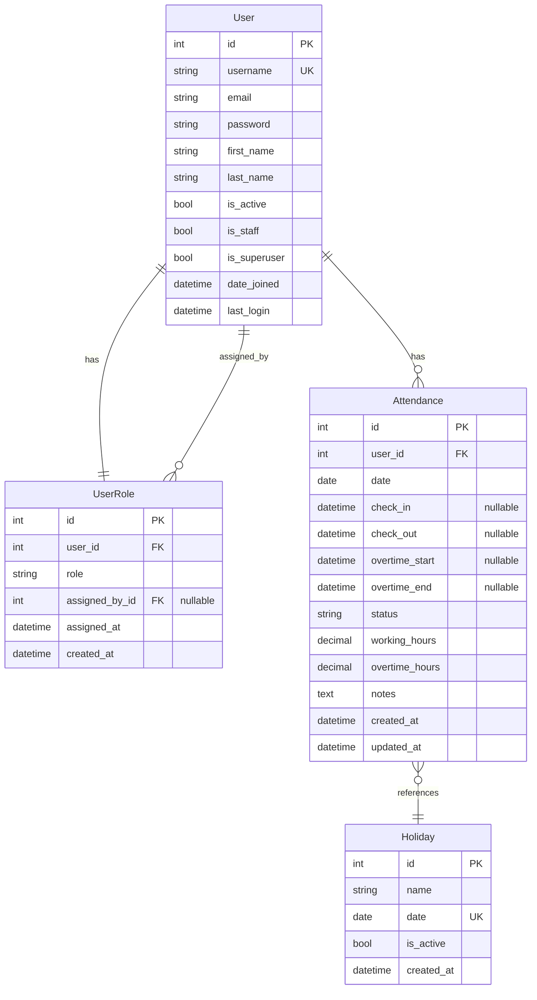

# Database ER Diagram - Auditra Project

## Overview

This document describes the Entity-Relationship (ER) diagram for the Auditra project database. The database uses PostgreSQL and is built with Django ORM.

## ER Diagram

### Visual Representation (Mermaid)



### Text-Based ER Diagram

```
┌─────────────────────────────────────────────────────────┐
│                         User                             │
│  (Django Built-in Model)                                 │
├─────────────────────────────────────────────────────────┤
│  PK │ id                    │ BigAutoField              │
│  UK │ username              │ CharField(150)            │
│     │ email                 │ EmailField                │
│     │ password              │ CharField(128)             │
│     │ first_name            │ CharField(150)            │
│     │ last_name             │ CharField(150)            │
│     │ is_active             │ BooleanField              │
│     │ is_staff              │ BooleanField              │
│     │ is_superuser          │ BooleanField              │
│     │ date_joined           │ DateTimeField             │
│     │ last_login            │ DateTimeField (nullable)  │
└─────────────────────────────────────────────────────────┘
                            │
                            │ One-to-One
                            │ (CASCADE)
                            │
                            ▼
┌─────────────────────────────────────────────────────────┐
│                      UserRole                            │
│  (Custom Model - Role-Based Access Control)              │
├─────────────────────────────────────────────────────────┤
│  PK │ id                    │ BigAutoField              │
│  FK │ user_id               │ OneToOneField → User      │
│     │ role                  │ CharField(50)              │
│     │                       │ Choices:                   │
│     │                       │   - admin                  │
│     │                       │   - coordinator            │
│     │                       │   - field_officer          │
│     │                       │   - accessor               │
│     │                       │   - senior_valuer          │
│     │                       │   - md_gm                  │
│     │                       │   - hr_staff               │
│     │                       │   - general_employee       │
│     │                       │   - client                 │
│     │                       │   - agent                  │
│     │                       │   - unassigned (default)   │
│  FK │ assigned_by_id        │ ForeignKey → User         │
│     │                       │ (nullable, SET_NULL)       │
│     │ assigned_at           │ DateTimeField (auto_now)   │
│     │ created_at            │ DateTimeField             │
│     │                       │ (auto_now_add)            │
└─────────────────────────────────────────────────────────┘
                            ▲
                            │
                            │ Many-to-One
                            │ (SET_NULL)
                            │
                            │
                    ┌───────┴───────┐
                    │     User      │
                    │ (assigned_by) │
                    └───────────────┘
```

## Entity Descriptions

### 1. User (Django Built-in Model)

**Table Name:** `auth_user`  
**Description:** Core user authentication model provided by Django. Stores user credentials and basic profile information.

**Key Fields:**
- `id`: Primary key (auto-incrementing integer)
- `username`: Unique username for login (max 150 characters)
- `email`: User's email address
- `password`: Hashed password (stored using Django's password hashing)
- `first_name`, `last_name`: User's name
- `is_active`: Whether the user account is active
- `is_staff`: Whether the user can access admin site
- `is_superuser`: Whether the user has all permissions
- `date_joined`: Timestamp when account was created
- `last_login`: Timestamp of last login (nullable)

**Relationships:**
- One-to-One with `UserRole` (via `user` field)
- One-to-Many with `UserRole` (via `assigned_by` field - users who assigned roles)

### 2. UserRole (Custom Model)

**Table Name:** `user_roles`  
**Description:** Extends the User model with role-based access control (RBAC). Each user has exactly one role that determines their permissions and access levels in the system.

**Key Fields:**
- `id`: Primary key (auto-incrementing integer)
- `user`: One-to-One relationship with User (CASCADE delete)
- `role`: User's role in the system (see Role Choices below)
- `assigned_by`: Foreign key to User who assigned this role (nullable, SET_NULL on delete)
- `assigned_at`: Timestamp when role was last assigned/updated (auto-updated)
- `created_at`: Timestamp when role record was created (auto-set on creation)

**Relationships:**
- One-to-One with `User` (via `user` field)
- Many-to-One with `User` (via `assigned_by` field)

### 3. Attendance (Custom Model)

**Table Name:** `attendances`  
**Description:** Tracks daily attendance for field officers, including check-in/check-out times, working hours, and overtime.

**Key Fields:**
- `id`: Primary key (auto-incrementing integer)
- `user`: Foreign key to User (CASCADE delete)
- `date`: Date of attendance (unique per user per date)
- `check_in`: Timestamp when user checked in (nullable)
- `check_out`: Timestamp when user checked out (nullable)
- `overtime_start`: Timestamp when overtime started (nullable, after 5 PM)
- `overtime_end`: Timestamp when overtime ended (nullable)
- `status`: Attendance status - 'present', 'half_day', 'absent', 'leave'
- `working_hours`: Calculated working hours (8 AM - 5 PM, max 9 hours)
- `overtime_hours`: Calculated overtime hours
- `notes`: Optional notes about attendance
- `created_at`: Timestamp when record was created
- `updated_at`: Timestamp when record was last updated

**Relationships:**
- Many-to-One with `User` (via `user` field)

**Business Logic:**
- Working hours are calculated automatically from check_in to check_out
- Status is determined by working hours: >= 4.5 hours = full day, > 0 = half day
- Overtime can only start after 5 PM and after regular check-out
- Working days exclude Sundays and holidays

### 4. Holiday (Custom Model)

**Table Name:** `holidays`  
**Description:** Stores Sri Lankan public holidays to determine non-working days.

**Key Fields:**
- `id`: Primary key (auto-incrementing integer)
- `name`: Name of the holiday
- `date`: Date of the holiday (unique)
- `is_active`: Whether the holiday is currently active
- `created_at`: Timestamp when record was created

**Relationships:**
- Referenced by `Attendance` model for working day calculations

**Usage:**
- Used to determine if a date is a working day
- Can be populated using management command: `python manage.py populate_holidays`

## Role Choices

The `role` field in `UserRole` can have one of the following values:

| Role Value | Display Name | Description |
|------------|--------------|-------------|
| `admin` | Admin | System administrator with full access |
| `coordinator` | Coordinator | Project coordinator role |
| `field_officer` | Field Officer | Field operations officer |
| `accessor` | Accessor | Access control role |
| `senior_valuer` | Senior Valuer | Senior valuation role |
| `md_gm` | MD/GM | Managing Director/General Manager |
| `hr_staff` | HR Staff | Human resources staff member |
| `general_employee` | General Employee | Standard employee role |
| `client` | Client | External client user |
| `agent` | Agent | Agent role |
| `unassigned` | Unassigned | Default role for new users |

## Relationships Details

### 1. User ↔ UserRole (One-to-One)
- **Type:** One-to-One
- **Direction:** User → UserRole
- **Field:** `UserRole.user` (OneToOneField)
- **On Delete:** CASCADE (if User is deleted, UserRole is deleted)
- **Description:** Every user has exactly one role. When a user is created, a UserRole with `unassigned` role is automatically created via Django signal.

### 2. User ↔ UserRole (Many-to-One)
- **Type:** Many-to-One
- **Direction:** User → UserRole (via `assigned_by`)
- **Field:** `UserRole.assigned_by` (ForeignKey)
- **On Delete:** SET_NULL (if assigning user is deleted, field is set to NULL)
- **Description:** Tracks which user assigned a role to another user. This allows audit trails for role assignments.

## Database Constraints

### Primary Keys
- `User.id`: Primary key for User table
- `UserRole.id`: Primary key for UserRole table

### Foreign Keys
- `UserRole.user_id` → `User.id` (OneToOne, CASCADE)
- `UserRole.assigned_by_id` → `User.id` (ForeignKey, SET_NULL)
- `Attendance.user_id` → `User.id` (ForeignKey, CASCADE)

### Unique Constraints
- `User.username`: Must be unique
- `UserRole.user_id`: Must be unique (OneToOne constraint)
- `Attendance.user_id + Attendance.date`: Must be unique (one attendance per user per day)
- `Holiday.date`: Must be unique

### Indexes
- Django automatically creates indexes on foreign keys
- `User.username` has an index for unique constraint

## Automatic Behaviors

### Signals
Django signals automatically handle:
1. **User Creation:** When a new `User` is created, a `UserRole` with `role='unassigned'` is automatically created
2. **User Save:** When a `User` is saved, the associated `UserRole` is also saved if it exists

## Database Configuration

- **Database Engine:** PostgreSQL
- **Database Name:** `auditra_db` (configurable via environment variables)
- **Default Port:** 5432
- **Character Encoding:** UTF-8

## Sample Queries

### Get User with Role
```sql
SELECT u.username, u.email, ur.role, ur.assigned_at
FROM auth_user u
JOIN user_roles ur ON u.id = ur.user_id
WHERE u.username = 'john_doe';
```

### Get All Users Assigned by a Specific User
```sql
SELECT u.username, ur.role, ur.assigned_at
FROM user_roles ur
JOIN auth_user u ON ur.user_id = u.id
WHERE ur.assigned_by_id = (
    SELECT id FROM auth_user WHERE username = 'admin'
);
```

### Get Role Distribution
```sql
SELECT role, COUNT(*) as count
FROM user_roles
GROUP BY role
ORDER BY count DESC;
```

### Get User Attendance Summary
```sql
SELECT 
    a.date,
    a.status,
    a.working_hours,
    a.overtime_hours,
    a.check_in,
    a.check_out
FROM attendances a
WHERE a.user_id = 1
    AND a.date >= CURRENT_DATE - INTERVAL '30 days'
ORDER BY a.date DESC;
```

### Get Monthly Attendance Statistics
```sql
SELECT 
    DATE_TRUNC('month', date) as month,
    COUNT(*) FILTER (WHERE status = 'present') as present_days,
    COUNT(*) FILTER (WHERE status = 'half_day') as half_days,
    COUNT(*) FILTER (WHERE status = 'absent') as absent_days,
    SUM(working_hours) as total_working_hours,
    SUM(overtime_hours) as total_overtime_hours
FROM attendances
WHERE user_id = 1
    AND date >= DATE_TRUNC('year', CURRENT_DATE)
GROUP BY DATE_TRUNC('month', date)
ORDER BY month DESC;
```

## Future Enhancements

Potential additions to the database schema:
- Audit logs for role changes
- Permission groups
- User profiles with additional fields
- Session management tables
- Activity logs

---

**Last Updated:** Generated from Django models  
**Django Version:** 5.0  
**Database:** PostgreSQL

